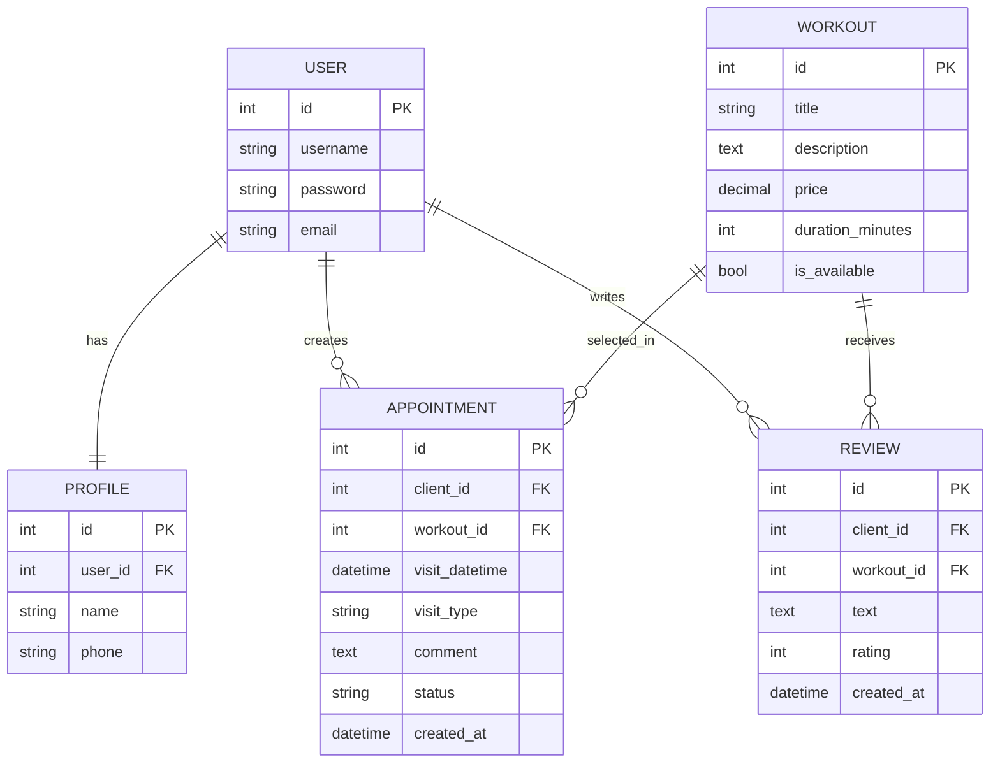

# ER-диаграмма FitTime

```mermaid
erDiagram
    USER ||--|| PROFILE : has
    USER ||--o{ APPOINTMENT : creates
    USER ||--o{ REVIEW : writes
    WORKOUT ||--o{ APPOINTMENT : selected_in
    WORKOUT ||--o{ REVIEW : receives

    USER {
        int id PK
        string username
        string password
        string email
    }
    PROFILE {
        int id PK
        int user_id FK
        string name
        string phone
    }
    WORKOUT {
        int id PK
        string title
        text description
        decimal price
        int duration_minutes
        bool is_available
    }
    APPOINTMENT {
        int id PK
        int client_id FK
        int workout_id FK
        datetime visit_datetime
        string visit_type
        text comment
        string status
        datetime created_at
    }
    REVIEW {
        int id PK
        int client_id FK
        int workout_id FK
        text text
        int rating
        datetime created_at
    }
```
